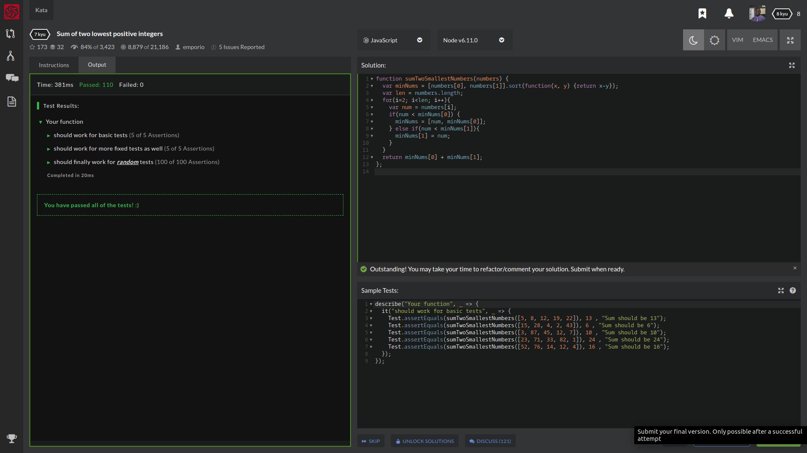

# My Awesome Project
Question:
Create a function that returns the sum of the two lowest positive numbers given an array of minimum 4 integers. No floats or empty arrays will be passed.

For example, when an array is passed like [19,5,42,2,77], the output should be 7.

[10,343445353,3453445,3453545353453] should return 3453455.

Hint: Do not modify the original array.

In this Codewars challenge, I received a question involving arrays.

## How It's Made
 I decided to grab the last two numbers with min, which returns an array of the two smallest values which I saved under the variable minNums[0] & minNums[1] and sort thru the numbers!

 var minNums = [numbers[0], numbers[1]].sort(function(x, y) {
   return x - y
 }); //Then I returned the sum of these two elements.

 I then created a variable for the numbers.length; for a for loop with the parameters to compare and go thru all the numbers+1 and have a if/else statement.

 var len = numbers.length;
 for (i = 2; i < len; i++) {
   var num = numbers[i];
   if (num < minNums[0]) {
     minNums = [num, minNums[0]];
   } else if (num < minNums[1]) {
     minNums[1] = num;
   }

## Sample Tests:
describe("Your function", _ => {
  it("should work for basic tests", _ => {
    Test.assertEquals(sumTwoSmallestNumbers([5, 8, 12, 19, 22]), 13 , "Sum should be 13");
    Test.assertEquals(sumTwoSmallestNumbers([15, 28, 4, 2, 43]), 6 , "Sum should be 6");
    Test.assertEquals(sumTwoSmallestNumbers([3, 87, 45, 12, 7]), 10 , "Sum should be 10");
    Test.assertEquals(sumTwoSmallestNumbers([23, 71, 33, 82, 1]), 24 , "Sum should be 24");
    Test.assertEquals(sumTwoSmallestNumbers([52, 76, 14, 12, 4]), 16 , "Sum should be 16");
  });
});

## Lessons Learned:

How to properly use .sort(), .length, for(loops), if/else statements help me create a function that returns the sum of the two lowest positive numbers given an array of minimum 4 integers.
## portfolio:

**WEBSITE:** https:/johnfleurimond.com

## Happy Coding
